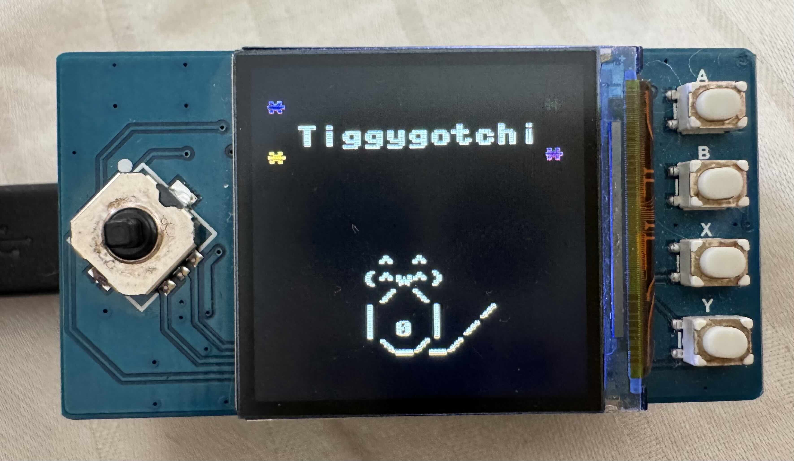

# Tiggygotchi 🐱

A Tamagotchi-style ASCII cat-feeding sim that doubles as a hello-world for the Raspberry Pi Pico + Waveshare Pico-LCD-1.3.



## What it does

- **Boot screen** — "Tiggygotchi" title screen appears for 5 seconds on power-up.
- **Walk** — use the 5-way joystick to move Tiggy (the cat) around the 240×240 screen.
- **Drop food** — buttons A/B/X/Y drop one of four foods at a random spot (fish, treat, bird, ramen).
- **Eat** — Tiggy eats when he walks onto a food; hearts float up and he purrs.
- **Sleep** — 10 seconds of no input and Tiggy dozes off with an animated Zzz.
- **Celebration** — eat one of every food type and "It's Tiggy Time!" flashes on screen.
- **Replay title** — press the joystick center button at any time to re-show the boot screen.

## Bill of materials

| Item | Approx. price (USD) | Notes |
|------|---------------------|-------|
| Raspberry Pi Pico (RP2040) | $4 | Pico W or Pico 2 also work. Headers must be soldered (or pre-soldered) to mate with the LCD hat. |
| Waveshare Pico-LCD-1.3 | $15 | 240×240 ST7789 LCD with 5-way joystick and 4 buttons. The pin assignments in `src/main.py` match this exact hat — different hats will need code changes. |
| USB cable (micro-USB for Pico, USB-C for Pico 2) | $5 | Must be a data cable, not a charge-only cable. |
| Computer (macOS / Linux / Windows) | — | You'll need Python 3 and `mpremote` to flash files. |

**Total: under $25 in parts.**

## Flashing MicroPython onto the Pico (one-time setup)

1. Download the latest stable MicroPython UF2 for the Pico from https://micropython.org/download/RPI_PICO/
2. Hold the **BOOTSEL** button on the Pico, then plug it into your computer via USB. The board mounts as a USB mass-storage drive named `RPI-RP2`.
3. Drag the `.uf2` file onto the `RPI-RP2` drive. The board reboots automatically and ejects the drive.
4. After flashing, the Pico reappears as a serial device:
   - macOS: `/dev/cu.usbmodem1101` (number may vary)
   - Linux: `/dev/ttyACM0`
   - Windows: `COM3` (check Device Manager)

## Installing mpremote

`mpremote` is the official MicroPython tool for copying files to the Pico and opening a REPL.

```bash
pipx install mpremote
```

If you don't have `pipx`:

```bash
pip3 install --user mpremote
```

## Deploying Tiggygotchi to the Pico

From a fresh clone, run these commands from your computer (not on the Pico):

```bash
git clone <repo-url>
cd Tiggygotchi
mpremote cp src/Pico_LCD_1_3.py :
mpremote cp src/main.py :
mpremote reset
```

The Pico runs `main.py` automatically on every power-up. Once the files are on the board, Tiggygotchi starts immediately — no computer required.

## Controls

| Control | Action | Notes |
|---------|--------|-------|
| Joystick up | Walk Tiggy up | |
| Joystick down | Walk Tiggy down | |
| Joystick left | Walk Tiggy left | |
| Joystick right | Walk Tiggy right | |
| Joystick center | Replay boot title screen | Works at any time during gameplay |
| Button A | Drop a fish | Appears at a random position |
| Button B | Drop a treat | Heart-shaped candy; appears at a random position |
| Button X | Drop a bird | Appears at a random position |
| Button Y | Drop a bowl of ramen | Appears at a random position |

## Hardware pin reference

These GPIO assignments are hardcoded in `src/main.py` and match the Waveshare Pico-LCD-1.3 published pinout.

### LCD (SPI)

| Signal | GPIO |
|--------|------|
| SCK (clock) | 10 |
| MOSI (data) | 11 |
| CS (chip select) | 9 |
| DC (data/command) | 8 |
| RST (reset) | 12 |
| BL (backlight) | 13 |

### Joystick

| Direction | GPIO |
|-----------|------|
| Up | 2 |
| Center | 3 |
| Left | 16 |
| Down | 18 |
| Right | 20 |

### Buttons

| Button | GPIO |
|--------|------|
| A | 15 |
| B | 17 |
| X | 19 |
| Y | 21 |

## Customizing & learning

All the logic lives in `src/main.py`, which is heavily commented to walk through MicroPython, the `framebuf` API, and GPIO pin handling. Good first tweaks to try:

- **Change a sprite** — find the ASCII/pixel cat definition near the top and swap in your own characters.
- **Add a new food** — copy an existing food entry and assign it to a spare button or key combo.
- **Change the sleep timeout** — find `SLEEP_TIMEOUT_MS` and set it to whatever you like.
- **Change colors** — the `RED`, `GREEN`, `BLUE`, etc. constants are defined near the top of the file.

## Troubleshooting

**Nothing appears on the screen.**
Make sure the LCD hat is fully and evenly seated on the Pico's headers (no bent pins). Then confirm MicroPython is actually running:

```bash
mpremote exec "import sys; print(sys.implementation)"
```

If that prints a version string, MicroPython is alive. If `mpremote` can't connect, re-flash the UF2.

**`mpremote: cp: No such file or directory`**
You ran the `cp` commands from the wrong directory. `cd Tiggygotchi` first, then retry.

**Colors look swapped (red appears blue, etc.)**
The RGB565 byte order in `framebuf` can vary between builds. Swap the `RED` and `BLUE` constant values in `src/main.py` to fix it.

## Credits

Built with Claude Code (Anthropic). Display driver vendored from Waveshare.
